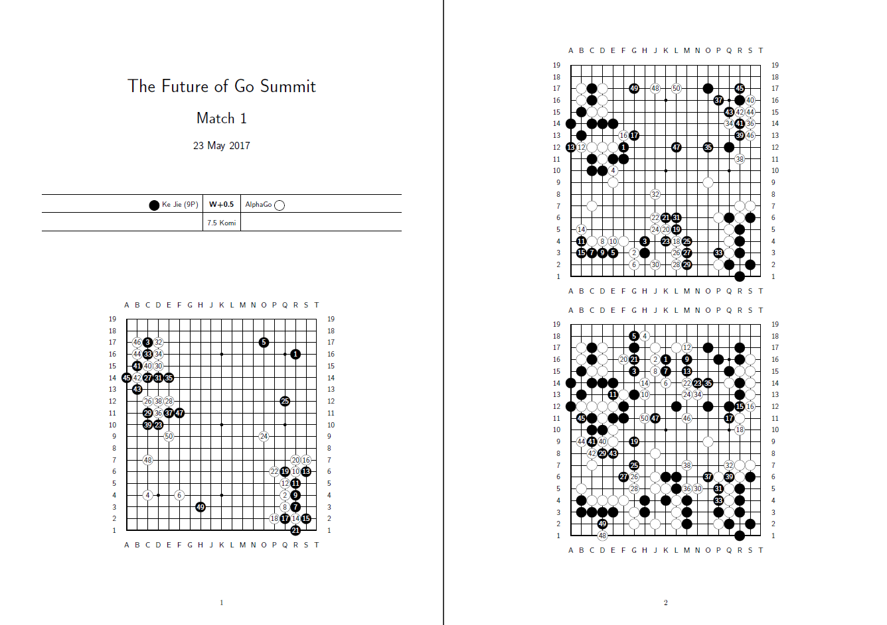

# kifugen

Generate printable pdf game records (kifu) from `sgf` go/baduk/weiqi replays.
kifugen takes your `sgf` file and converts is into a `latex` format, that then can
be easily compiled into a pdf file.

# Requirements

To to produce the `tex` file you need:
- Python 3.6

If you want to compile it as a `pdf` you also need:
- A latex distribution with:
    - `latex`
    - `dvips`
    - `ps2pdf`
    - the `psgo` package

# Usage
The basic usage is `kifugen <file> [options]` where file is the `.sgf` file and options are:

| Option         | Meaning                       | Default   |
| :------------- | :---------------------------- | :-------- |
| -se n          | start new board every n moves | 50        |

| Flags          | Meaning                       |
| :------------- | :---------------------------- |
| -cn            | continuous numbering          |
| -t             | produce `tex` file only       |
| -o             | open the pdf after compilation|
